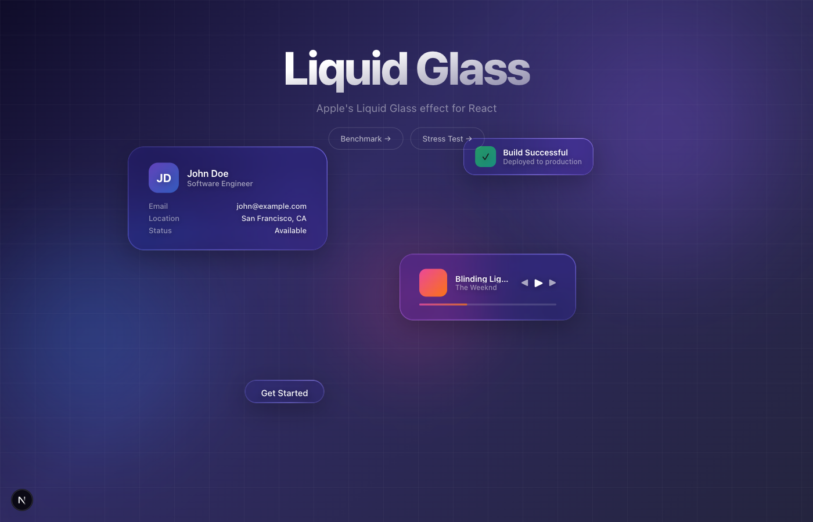
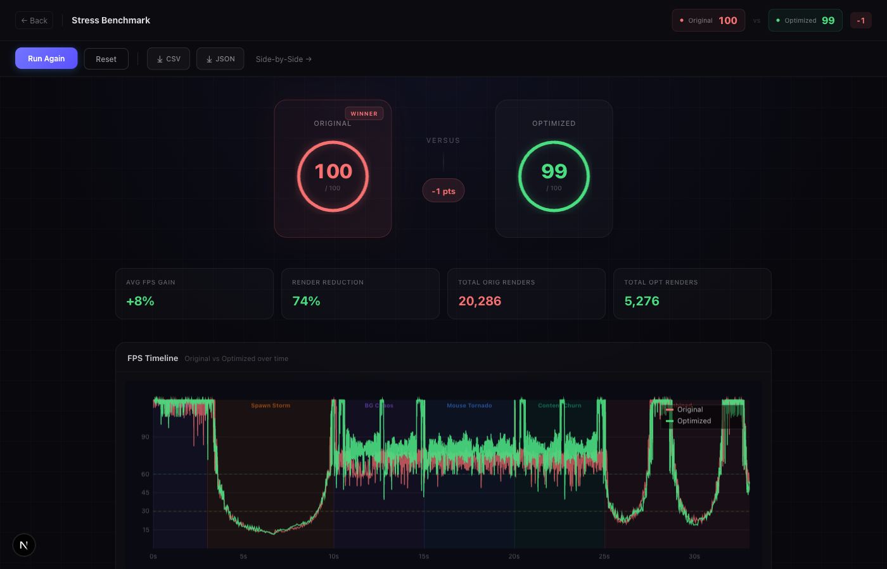
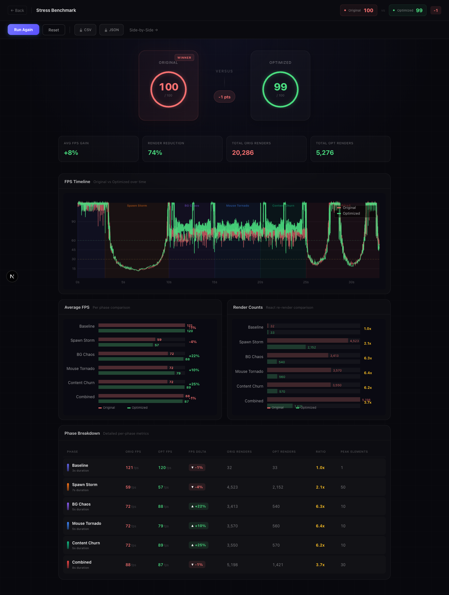

<div align="center">

# Liquid Glass React

**Apple's Liquid Glass effect, recreated for React.**

[](https://www.npmjs.com/package/liquid-glass-react)
[](./LICENSE)
[](https://bundlephobia.com/package/liquid-glass-react)

[Live Demo](https://iniru.github.io/liquid-glass-react) · [Stress Benchmark](https://iniru.github.io/liquid-glass-react/stress-benchmark) · [npm](https://www.npmjs.com/package/liquid-glass-react)

<br />



</div>

<br />

## Features

- Realistic edge bending and refraction
- Multiple refraction modes — `standard`, `polar`, `prominent`, `shader`
- Configurable frosting, saturation, and chromatic aberration
- Liquid elastic feel on hover and click
- Edges and highlights adapt to underlying content, just like Apple's
- Supports arbitrary children and custom padding
- Optimized rendering pipeline with shader map caching

> **Note:** Safari and Firefox only partially support the effect (displacement will not be visible).

<br />

## Quick Start

```bash
npm install liquid-glass-react
```

```tsx
import LiquidGlass from "liquid-glass-react";

function App() {
  return (
    <LiquidGlass>
      <div className="p-6">
        <h2>Your content here</h2>
        <p>This will have the liquid glass effect</p>
      </div>
    </LiquidGlass>
  );
}
```

<br />

## Examples

### Card

```tsx
<LiquidGlass
  displacementScale={70}
  blurAmount={0.0625}
  saturation={140}
  aberrationIntensity={2}
  elasticity={0.15}
  cornerRadius={24}
  padding="24px"
>
  <h2>John Doe</h2>
  <p>Software Engineer</p>
</LiquidGlass>
```

### Button

```tsx
<LiquidGlass
  displacementScale={64}
  blurAmount={0.1}
  saturation={130}
  aberrationIntensity={2}
  elasticity={0.35}
  cornerRadius={100}
  padding="8px 16px"
  onClick={() => console.log("clicked!")}
>
  <span className="text-white font-medium">Click Me</span>
</LiquidGlass>
```

|Card|Button|
|:-:|:-:|
|||

### Mouse Container

Track mouse movement over a larger parent area:

```tsx
function App() {
  const containerRef = useRef<HTMLDivElement>(null);

  return (
    <div ref={containerRef} className="w-full h-screen">
      <LiquidGlass
        mouseContainer={containerRef}
        elasticity={0.3}
        style={{ position: "fixed", top: "50%", left: "50%" }}
      >
        <div className="p-6">Glass responds to mouse anywhere</div>
      </LiquidGlass>
    </div>
  );
}
```

<br />

## Props

| Prop | Type | Default | Description |
|:-----|:-----|:--------|:------------|
| `children` | `ReactNode` | — | Content inside the glass |
| `displacementScale` | `number` | `70` | Displacement intensity |
| `blurAmount` | `number` | `0.0625` | Blur / frosting level |
| `saturation` | `number` | `140` | Color saturation |
| `aberrationIntensity` | `number` | `2` | Chromatic aberration |
| `elasticity` | `number` | `0.15` | Liquid feel (`0` = rigid) |
| `cornerRadius` | `number` | `999` | Border radius (px) |
| `padding` | `string` | — | CSS padding |
| `className` | `string` | `""` | CSS classes |
| `style` | `CSSProperties` | — | Inline styles |
| `overLight` | `boolean` | `false` | Light background mode |
| `onClick` | `() => void` | — | Click handler |
| `mouseContainer` | `RefObject<HTMLElement>` | `null` | External mouse tracking area |
| `mode` | `"standard" \| "polar" \| "prominent" \| "shader"` | `"standard"` | Refraction mode |
| `globalMousePos` | `{ x, y }` | — | Manual mouse position |
| `mouseOffset` | `{ x, y }` | — | Mouse position offset |

<br />

## Benchmark

An interleaved stress benchmark compares **Original** vs **Optimized** rendering pipelines across 6 phases — Baseline, Spawn Storm, BG Chaos, Mouse Tornado, Content Churn, and Combined.

<div align="center">

</div>

### Key Results

| Metric | Value |
|:-------|:------|
| Avg FPS Gain | **+8%** |
| Render Reduction | **74% fewer** re-renders |
| Render Ratio | **3.9x** fewer renders (20,286 → 5,276) |

<details>
<summary><b>Phase Breakdown</b></summary>

<br />

| Phase | Orig FPS | Opt FPS | Delta | Orig Renders | Opt Renders | Ratio |
|:------|:--------:|:-------:|:-----:|:------------:|:-----------:|:-----:|
| Baseline | 121 | 120 | -1% | 32 | 33 | 1.0x |
| Spawn Storm | 59 | 57 | -4% | 4,523 | 2,152 | 2.1x |
| BG Chaos | 72 | 88 | **+22%** | 3,413 | 540 | 6.3x |
| Mouse Tornado | 72 | 79 | **+10%** | 3,570 | 560 | 6.4x |
| Content Churn | 72 | 89 | **+25%** | 3,550 | 570 | 6.2x |
| Combined | 88 | 87 | -1% | 5,198 | 1,421 | 3.7x |

</details>

<details>
<summary><b>Full Results Dashboard</b></summary>

<br />

<div align="center">

</div>

</details>

> Run it yourself at [/stress-benchmark](https://iniru.github.io/liquid-glass-react/stress-benchmark). Results are downloadable as CSV/JSON.

<br />

## Optimizations

The optimized pipeline includes:

- **Shader map caching** — module-level `Map` avoids regenerating displacement maps for the same dimensions
- **`useMemo` shader URLs** — replaces `useState` + `useEffect` to eliminate extra renders
- **`ResizeObserver`** — replaces `window.resize` listener for precise, per-element size tracking
- **RAF-batched DOM updates** — `useRef` + `requestAnimationFrame` instead of `setState` for mouse tracking
- **Fast-path mouse rejection** — cached bounding rect skips `getBoundingClientRect` when cursor is far away
- **Early exit guard** — skips `updateDOM` entirely when element is inactive with zero opacity

<br />

## Demo


<br />

## License

[ISC](./LICENSE)
